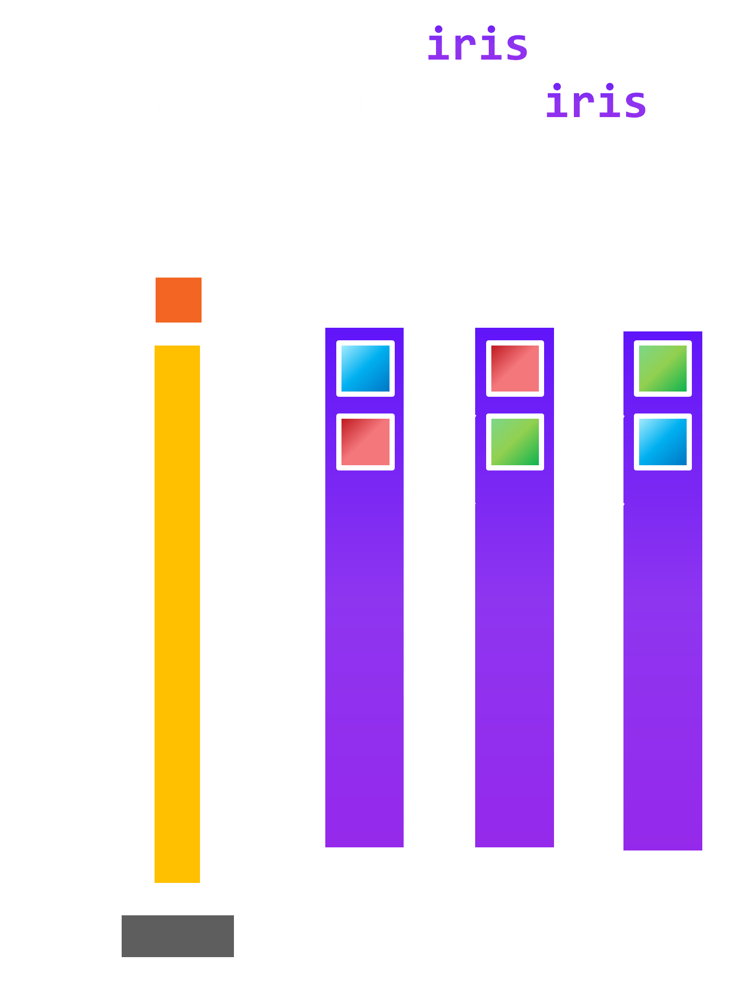
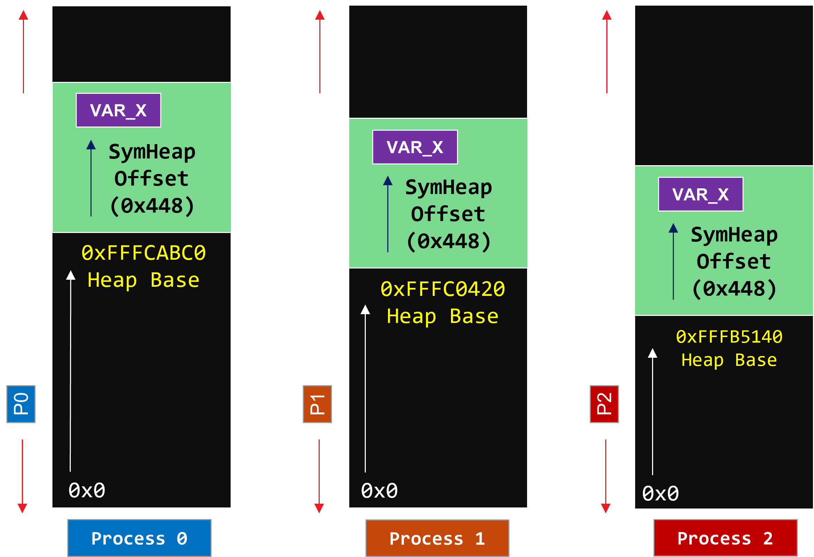

<!--
SPDX-License-Identifier: MIT
Copyright (c) 2025 Advanced Micro Devices, Inc. All rights reserved.
-->

**[README](../README.md)** » **Programming Model**

# Programming Model


Iris is an open-source triton-based framework for Remote Memory Access (RMA)[^1] operations written in only a few 100 lines of code. Iris provides SHMEM-like APIs within Triton for Multi-GPU programming.
<picture>
  <source media="(prefers-color-scheme: dark)" srcset="../images/iris-model.png">
  <source media="(prefers-color-scheme: light)" srcset="../images/iris-model-light.png">
  
</picture>

1. **Designed by Experts, Built for Scale**
    - Written from scratch by GPU and distributed computing experts
    - Minimal dependencies: only Triton, PyTorch, HIP runtime and mpi4py (for initialization)
    - No external frameworks or heavyweight runtimes beyond core stack

2. **Clean Abstractions**
    - Full Symmetric Heap implementation in Python
    - Pythonic PyTorch-like host APIs for tensor allocation and construction
    - Pythonic Triton-style device APIs for load, store, and atomic ops

3. **Communication + Computation**
    - Device-side collective ops: broadcast, scatter, reduce, etc.
    - Lock variants for communication and computation overlap
    - Fine-grained GEMM + communication overlap via workgroup specialization

4. **Scalable by Design**
    - Full scale-up (multi-GPU node) support
    - Scale-out (multi-node) in progress

[^1]: Remote Direct Memory Access (RDMA) is work-in-progress.

## Simple `load` & `store` APIs

```python
@triton.jit
def load(pointer, to_rank, from_rank, heap_bases, mask=None):
    """
    Loads a value from the specified rank's memory location.

    This function performs a memory read operation by translating the pointer
    from the from_rank's address space to the to_rank's address space and loading
    data from the target memory location. If the from_rank and to_rank are the same,
    this function performs a local load operation.

    Args:
        pointer (triton.PointerType, or block of dtype=triton.PointerType): Pointer in the from_rank's address space that will be translated to the to_rank's address space. Must be the current rank where the pointer is local.
        to_rank (int): The rank ID to which the pointer will be translated. Must be the current rank where the pointer is local.
        from_rank (int): The rank ID from which to read the data.
        heap_bases (triton.PointerType): Array containing the heap base addresses for all ranks.
        mask (Block of triton.int1, optional): If mask[idx] is false, do not load the data at address pointer[idx]. Defaults to None.

    Returns:
        Block: The loaded value from the target memory location.
    """
```

```python
@triton.jit
def store(pointer, value, from_rank, to_rank, heap_bases, mask=None):
    """
    Writes data to the specified rank's memory location.

    This function performs a memory write operation by translating the pointer
    from the from_rank's address space to the to_rank's address space and storing
    the provided data to the target memory location. If the from_rank and to_rank are the same,
    this function performs a local store operation.

    Args:
        pointer (triton.PointerType, or block of dtype=triton.PointerType): Pointer in the from_rank's address space that will be translated to the to_rank's address space. Must be the current rank where the pointer is local.
        value (Block): The tensor of elements to be stored.
        from_rank (int): The rank ID from which the pointer originates. Must be the current rank where the pointer is local.
        to_rank (int): The rank ID to which the data will be written.
        heap_bases (triton.PointerType): Array containing the heap base addresses for all ranks.
        mask (Block of triton.int1, optional): If mask[idx] is false, do not store the data at address pointer[idx]. Defaults to None.

    Returns:
        None
    """
```

## `iris` Symmetric Heap & Implementation

<picture>
  <source media="(prefers-color-scheme: dark)" srcset="../images/heap.png">
  <source media="(prefers-color-scheme: light)" srcset="../images/heap-light.png">
  
</picture>

Symmetric Heap is a Partitioned Global Address Space (PGAS) abstraction
Key idea is that you can know the remote address of any symmetric variable with two offsets:
1. Offset of target Process' heap base in its virtual address space
2. Offset of the variable within the symmetric heap

Allocation routine for symmetric variables must be collective or offset must be known. Must all_gather the base heap addresses across all processes.

```python
@triton.jit
def load(pointer, to_rank, from_rank, heap_bases, mask=None):
    translated_ptr = __translate(pointer, from_rank, to_rank, heap_bases)
    result = tl.load(translated_ptr, mask=mask)
    return result

@triton.jit
def __translate(ptr, from_rank, to_rank, heap_bases):
    from_base = tl.load(heap_bases + from_rank)
    to_base = tl.load(heap_bases + to_rank)
    ptr_int = tl.cast(ptr, tl.uint64)
    offset = ptr_int - from_base
    to_base_byte = tl.cast(to_base, tl.pointer_type(tl.int8))
    translated_ptr_byte = to_base_byte + offset
    translated_ptr = tl.cast(translated_ptr_byte, ptr.dtype)

    return translated_ptr
```
