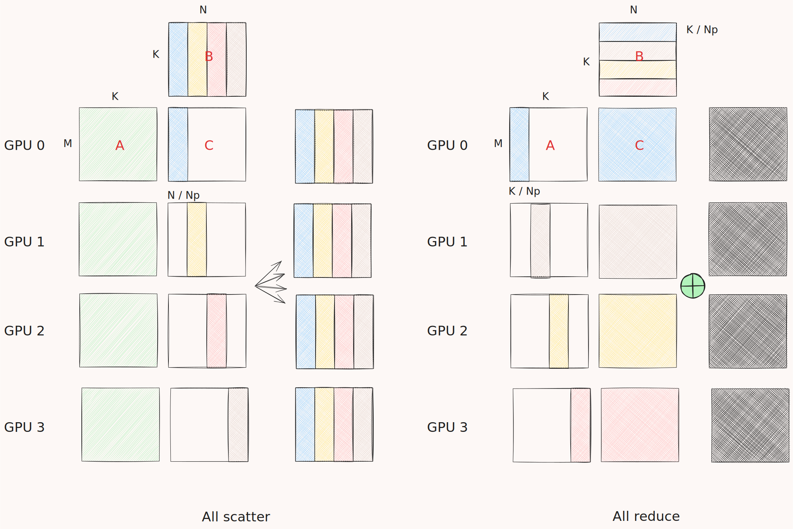

# Stream-K + Iris



## Algorithms
For Stream-K GEMMs + communication kernels, at the moment, we assume that:

$C = A \times B$
where,
* $B$ (weights): sharded column/row-wise across GPUs,
* $A$ (activations): replicated across GPUs, and
* $C$ (activations output): replicated across GPUs.

Currently, there are two implementations:

1. Stream-K + All reduce.
Where $B$ is partitioned *row-wise* and hence $A$ is partitioned column-wise so that we have two tall skinny matrices producing a partial $C$ with shape of $M \times N$ and the all reduce kernel reduces the results across all GPUs or ranks (right figure).

2. Stream-K + All scatter
Where $B$ is partitioned  *column-wise* and hence each rank produces non-overlapping columns in the output $C$ matrix such that we only need all gather/scatter to broadcast the final result (left figure).


You can run the example code by following these two steps:

```shell
cd stream-k
mpirun -np 4 python benchmark.py --benchmark --validate --algorithm one_shot
```

```terminal
python benchmark.py --help
usage: benchmark.py [-h] [-m M] [-n N] [-k K] [--debug] [--validate] [--benchmark] [--datatype {fp16,fp32,int8,bf16}] [--algorithm {all_reduce,all_scatter,one_shot}]
                    [--output_file OUTPUT_FILE] [--BLK_M BLK_M] [--BLK_N BLK_N] [--BLK_K BLK_K] [--COMMUNICATION_TILE_M COMMUNICATION_TILE_M] [--COMMUNICATION_TILE_N COMMUNICATION_TILE_N]
                    [--gsize_m GSIZE_M] [--two_tiles TWO_TILES] [--num_stages NUM_STAGES] [--num_warps NUM_WARPS] [--waves_per_eu WAVES_PER_EU] [--mfmaInstrSize MFMAINSTRSIZE]
                    [--kpack KPACK] [--heap_size HEAP_SIZE] [--gemm_sms STREAMK_SMS] [--total_sms TOTAL_SMS] [--communication_block_size COMMUNICATION_BLOCK_SIZE]

Parse matrix dimensions and configuration.

options:
  -h, --help            show this help message and exit
  -m M                  Number of rows in matrix A (default: 4864)
  -n N                  Number of columns in matrix B (default: 4096)
  -k K                  Common dimension between matrices A and B (default: 8256)
  --debug               Enable debug mode (default: False)
  --validate            Enable validation mode (default: False)
  --benchmark           Enable benchmarking mode (default: False)
  --datatype {fp16,fp32,int8,bf16}
                        Datatype of computation (default: fp32)
  --algorithm {all_reduce,all_scatter,one_shot}
                        Datatype of computation (default: all_reduce)
  --output_file OUTPUT_FILE
                        Output file (default: log.json)
  --BLK_M BLK_M         Block size M (default: 256)
  --BLK_N BLK_N         Block size N (default: 256)
  --BLK_K BLK_K         Block size K (default: 32)
  --COMMUNICATION_TILE_M COMMUNICATION_TILE_M
                        M tile size for reduction, scatter or one-shot (default: 128)
  --COMMUNICATION_TILE_N COMMUNICATION_TILE_N
                        N tile size for reduction, scatter or one-shot (default: 128)
  --gsize_m GSIZE_M     Grid size M (default: 8)
  --two_tiles TWO_TILES
                        Use two tiles (default: True)
  --num_stages NUM_STAGES
                        Number of stages (default: 1)
  --num_warps NUM_WARPS
                        Number of warps (default: 8)
  --waves_per_eu WAVES_PER_EU
                        Waves per execution unit (default: 0)
  --mfmaInstrSize MFMAINSTRSIZE
                        MFMA instruction size (default: 16)
  --kpack KPACK         K packing size (default: 2)
  --heap_size HEAP_SIZE
                        Iris heap size (default: 4294967296)
  --gemm_sms STREAMK_SMS
                        Number of SMs for Stream-K (default: 256)
  --total_sms TOTAL_SMS
                        Total number of SMs (default: 304)
  --communication_block_size COMMUNICATION_BLOCK_SIZE
                        Communication block size (default: 256)
```


## Reference implementations

There are two reference implementations (`all_gather.py` and `all_reduce.py`) that use RCCL inside the [reference](./reference/) directory. To run any of them,

```shell
cd reference
./run.sh
```

```terminal
(py_3.10) Apptainer> ./run.sh --help
Usage: ./run.sh [OPTIONS]

Options:
  -n, --num-gpus NUM      Number of GPUs to use (default: 2)
  -c, --collective NAME   Collective operation to run (default: all_gather)
  -h, --help              Show this help message and exit

Example:
  ./run.sh -n 4 -c all_reduce  # Run with 4 GPUs using all_reduce
```